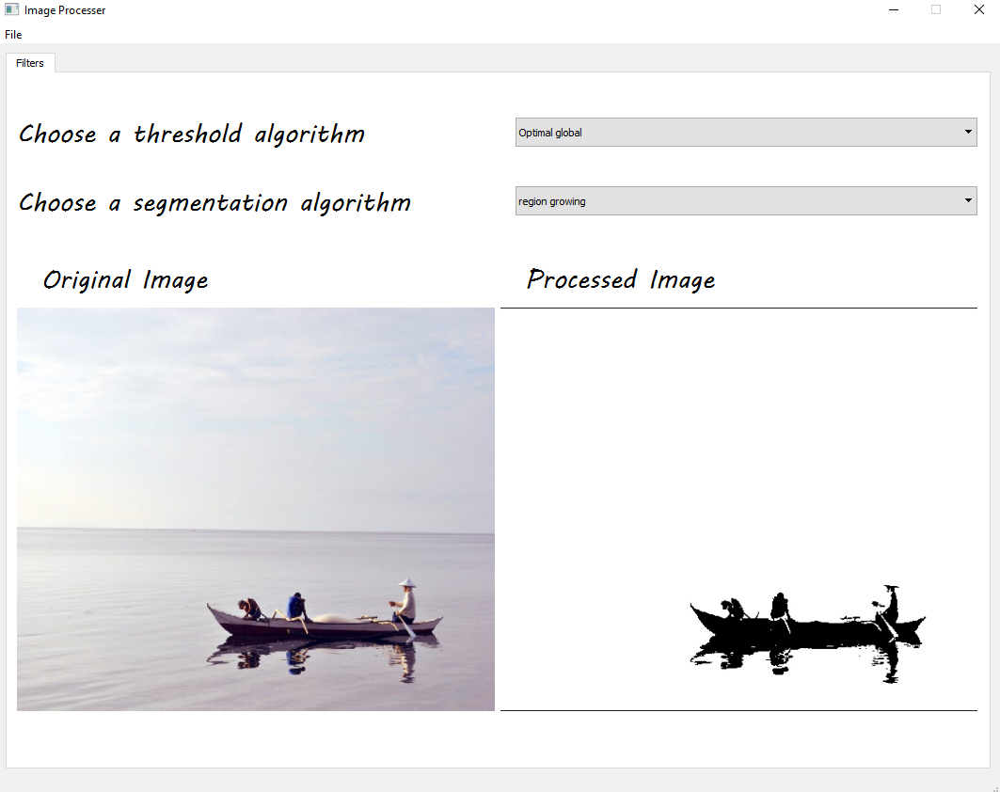
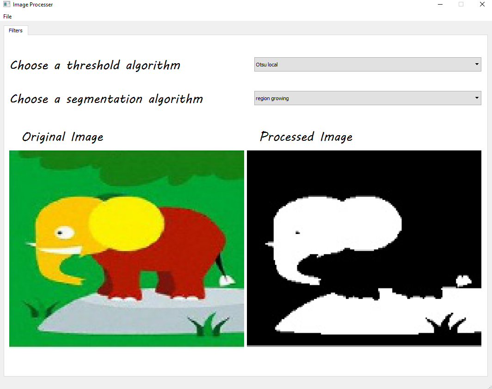
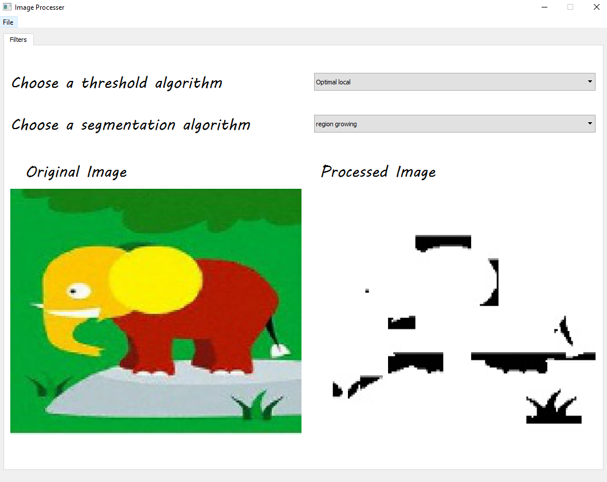
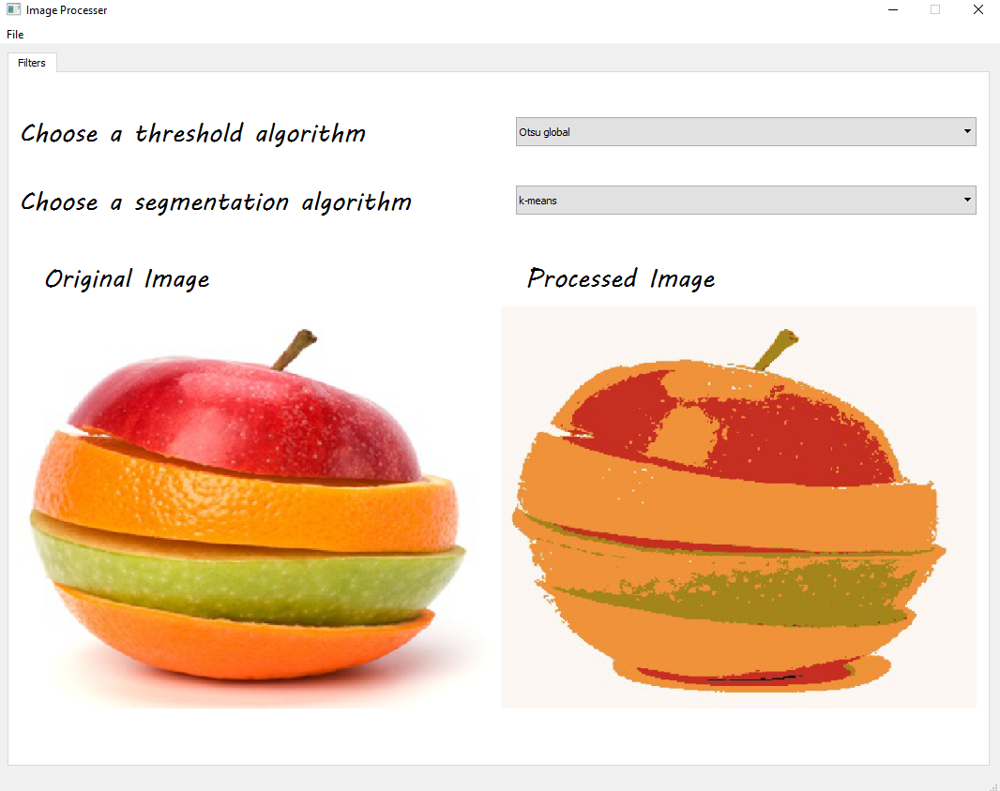
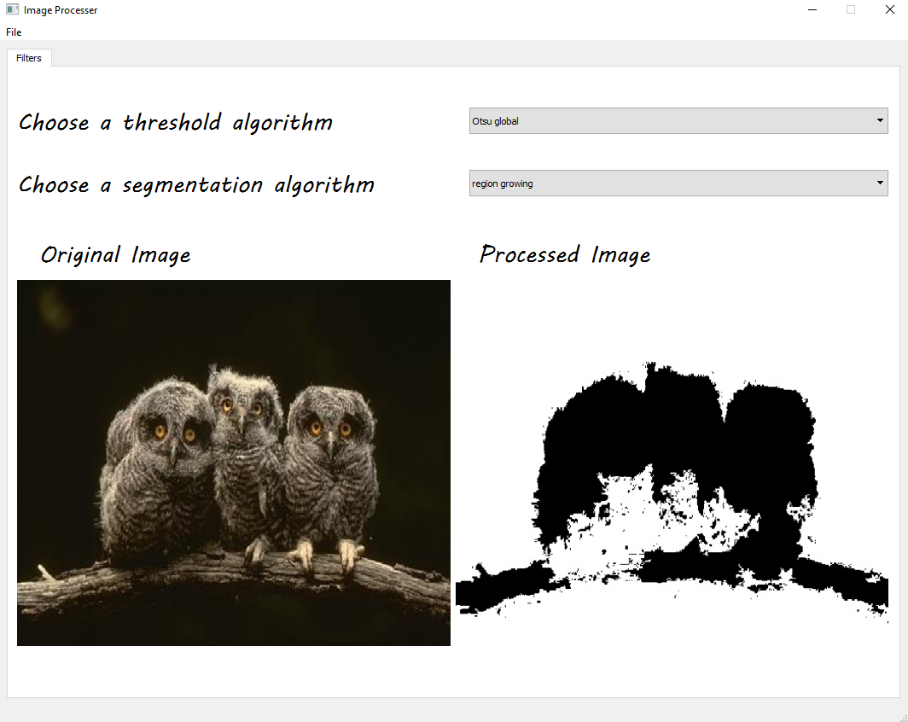
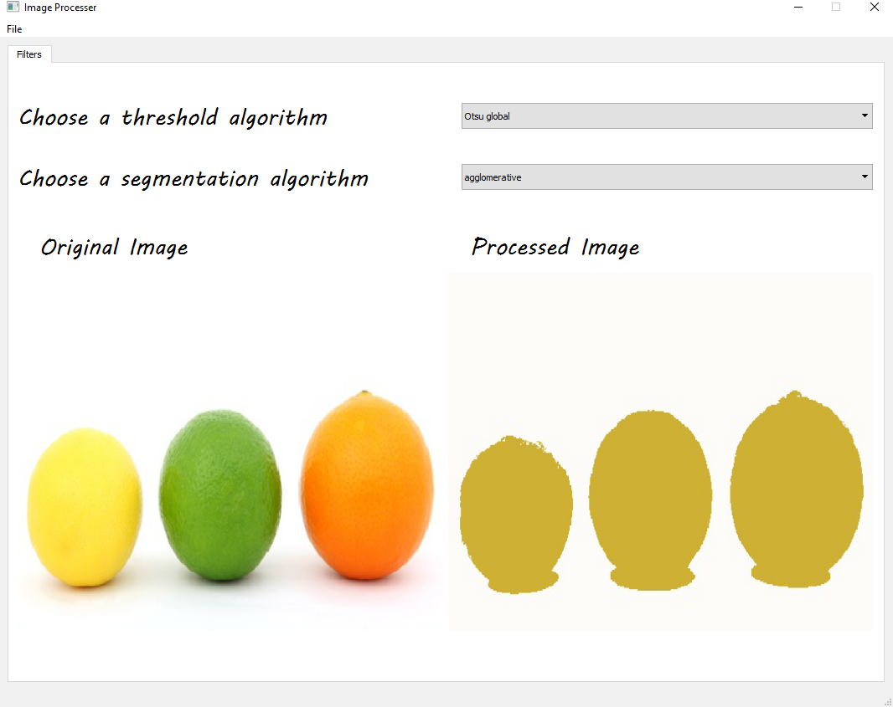
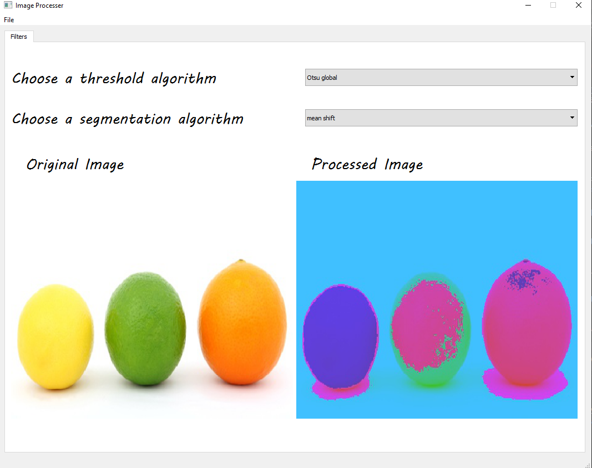

| Submitted to | Prof/ Ahmed M. Badawi |  |  |
| ----------- | ----------- | ----------- | ----------- |
| **By** | - Adel Moustafa | Sec: 2 | Bn: 3 |
|     | - Omar Ibrahim | Sec: 2 | Bn: 9 |
|     | - Mohamed Yasser | Sec: 2 | Bn: 24 |
| | - Mahmoud Abdelrhman | Sec: 2 | Bn: 25 |
| **Group ID** | 19 |  |  |

------

[TOC]

------

# Overview of the task

This project consists of 3 modules:  
1-**main.py**  : main program  
2-**GUI.py** : Pyqt GUI script  
3-**Thresholding.py** : contains the implementation of otsu local, otsu global, optimal local and optimal global  
4-**MEANSHIFT.py**: contains the implementation of mean shift segmentation
5-**kmean.py** : contains the implementation of k-mean segmentation 
6-**regionGrowing.py** : contains the implementation region growing segmentation
7-**agglo.py** : contains the implementation agglomerative segmentation
	
------

# Program description

- From File choose **load image** then choose the option wanted to apply on the image.

  `Note`: keep in mind that for image Matching you have to choose 2 images. 
------

# Results

- Otsu Global

  

- Optimal Global

  

- Otsu Local

  

- Optimal Local

  

- K-Mean 

  

- Region Growing

  

- Agglomerative

  

- Mean Shift

  

